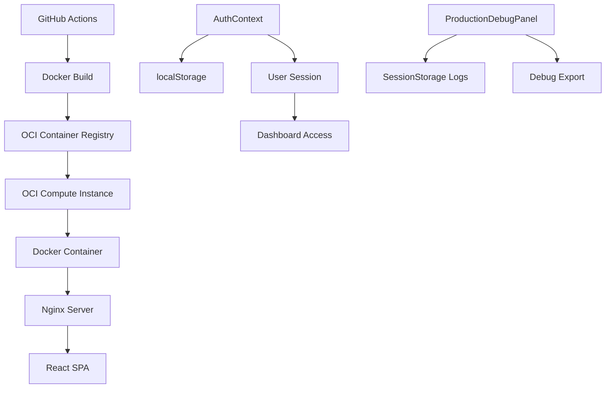

# Documento de Design - Correção de Deploy OCI

## Visão Geral

O problema identificado no deploy da aplicação Barbear.IA na OCI está relacionado a uma combinação de fatores: cache residual de containers, problemas de isolamento de sessão entre diferentes tipos de usuário, e possíveis diferenças de configuração entre ambiente local e produção. O sistema utiliza autenticação mock baseada em localStorage, e o problema manifesta-se especificamente quando usuários não-superadmin tentam acessar o dashboard após login bem-sucedido.

## Arquitetura

### Componentes Principais



### Fluxo de Autenticação Proposto

1. **Login Process**: Usuário seleciona tipo (super_admin, admin, barber, client)
2. **API Simulation**: Fetch de dados de `/src/database/users.json`
3. **Credential Validation**: Verificação contra dados JSON carregados
4. **Session Management**: Estado em memória + token mínimo no localStorage
5. **Context Update**: AuthContext atualiza estado do usuário
6. **Dashboard Rendering**: App.tsx renderiza componente baseado no role

### Fluxo de Autenticação Atual (Problemático)

1. **Login Process**: Usuário seleciona tipo (super_admin, admin, barber, client)
2. **Credential Validation**: Verificação contra mockUsers e mockPasswords hardcoded
3. **Session Storage**: Dados completos salvos em localStorage (authToken, userEmail)
4. **Context Update**: AuthContext atualiza estado do usuário
5. **Dashboard Rendering**: App.tsx renderiza componente baseado no role

### Problema Identificado

O sistema funciona perfeitamente em desenvolvimento local, mas em produção na OCI:
- **Super Admin**: Funciona normalmente
- **Outros usuários**: Autenticam com sucesso mas dashboard não carrega
- **Comportamento anômalo**: Após tentativa de login de usuário não-superadmin, até mesmo superadmin perde acesso (resolvido apenas com clear site data)

## Componentes e Interfaces

### 1. Sistema de Database Mock

**Estrutura**: `src/database/`
```
src/database/
├── users.json          # Dados dos usuários mockados
├── sessions.json       # Templates de sessão por tipo de usuário
├── api/
│   ├── auth.ts         # Simulação de endpoints de autenticação
│   └── users.ts        # Simulação de endpoints de usuários
```

**Benefícios**:
- Elimina dependência do localStorage para dados de usuário
- Reduz problemas de cache do navegador
- Simula comportamento real de API
- Facilita debugging e manutenção
- Permite versionamento dos dados de teste

### 2. Sistema de Limpeza de Container

**Arquivo**: `cleanup-container.sh`
- **Função**: Limpeza seletiva de recursos Docker relacionados ao barbear.ai
- **Preservação**: Mantém outros containers e recursos não relacionados
- **Validação**: Verifica porta 3500 e mata processos órfãos

### 2. Sistema de Deploy

**Arquivos**: `Dockerfile`, `docker-compose.yml`, `nginx.conf`
- **Build Stage**: Node.js 18-alpine com npm 10
- **Production Stage**: Nginx alpine com configurações anti-cache
- **Health Check**: Endpoint `/health` para monitoramento
- **Port Mapping**: Container porta 80 → Host porta 3500

### 3. Sistema de Autenticação

**Arquivos**: `src/contexts/AuthContext.tsx`, `src/database/*.json`
- **Mock API**: Simulação de API REST com arquivos JSON estáticos
- **Database Files**: Dados mockados em `/src/database/` (users.json, sessions.json)
- **Session Management**: Gerenciamento em memória com fallback mínimo para localStorage
- **Role-based Access**: Diferentes dashboards por role
- **Debug Logging**: Console logs detalhados para produção

### 4. Sistema de Debug

**Arquivo**: `src/components/debug/ProductionDebugPanel.tsx`
- **Production Only**: Ativo apenas em NODE_ENV=production
- **Log Collection**: sessionStorage para auth e dashboard logs
- **Export Function**: Download de logs em JSON
- **Real-time Monitoring**: Atualização a cada 5 segundos

## Modelos de Dados

### User Model
```typescript
interface User {
  id: string;
  name: string;
  email: string;
  role: 'super_admin' | 'admin' | 'barber' | 'client';
  tenantId?: string;
  avatar: string;
  phone: string;
  isActive: boolean;
  createdAt: string;
  lastLogin: string;
}
```

### Debug Log Model
```typescript
interface DebugLog {
  timestamp: string;
  message: string;
  data: string | null;
  url: string;
}
```

### Container State Model
```typescript
interface ContainerState {
  containers: Array<{
    name: string;
    image: string;
    status: string;
    ports: string;
  }>;
  images: number;
  volumes: number;
  port3500Status: 'free' | 'occupied';
}
```

## Tratamento de Erros

### 1. Container Cleanup Errors
- **Scenario**: Container não existe ou não pode ser parado
- **Handling**: Continue com próximo passo, log warning
- **Recovery**: Verificação final de porta e processos

### 2. Authentication Errors
- **Scenario**: localStorage corrompido ou inacessível
- **Handling**: Clear storage e redirect para login
- **Recovery**: Reinicialização completa da sessão

### 3. Cache-related Errors
- **Scenario**: Cache do navegador interfere com aplicação
- **Handling**: Headers anti-cache no nginx
- **Recovery**: Force reload de recursos críticos

### 4. Deploy Pipeline Errors
- **Scenario**: Build falha ou container não inicia
- **Handling**: Rollback automático via healthcheck
- **Recovery**: Rebuild com cache limpo

## Estratégia de Testes

### 1. Testes de Limpeza de Container
- **Unit Tests**: Validar scripts de limpeza isoladamente
- **Integration Tests**: Testar limpeza em ambiente similar à OCI
- **Safety Tests**: Garantir que outros containers não são afetados

### 2. Testes de Autenticação
- **Role-based Tests**: Validar acesso para cada tipo de usuário
- **Session Isolation Tests**: Garantir que sessões não interferem entre si
- **Mock API Tests**: Validar que simulação de API funciona corretamente
- **Memory Management Tests**: Validar que dados em memória não vazam entre sessões

### 3. Testes de Deploy
- **Build Tests**: Validar que build produz artefatos corretos
- **Container Tests**: Validar que container inicia e responde
- **Health Check Tests**: Validar endpoints de monitoramento

### 4. Testes de Debug
- **Log Collection Tests**: Validar que logs são coletados corretamente
- **Export Function Tests**: Validar que export funciona em produção
- **Performance Tests**: Garantir que debug não impacta performance

## Configurações de Ambiente

### Desenvolvimento Local
```bash
NODE_ENV=development
VITE_API_URL=http://localhost:3000
VITE_DEBUG_MODE=true
```

### Produção OCI
```bash
NODE_ENV=production
VITE_API_URL=https://api.barbear.ia
VITE_DEBUG_MODE=false
```

### Docker Environment
```yaml
environment:
  - NODE_ENV=production
healthcheck:
  test: ["CMD-SHELL", "curl -f http://localhost:80/ || exit 1"]
  interval: 15s
  timeout: 3s
  retries: 5
```

## Plano de Implementação

### Fase 1: Preparação e Branch Dedicada
1. Criar branch específica para correção: `fix/oci-auth-issues`
2. Analisar código atual para identificar pontos de refatoração
3. Planejar estrutura de arquivos JSON e simulação de API

### Fase 2: Refatoração do Sistema de Autenticação (Desenvolvimento Local)
1. Criar estrutura `/src/database/` com arquivos JSON
2. Implementar simulação de API REST para autenticação
3. Refatorar AuthContext para usar dados JSON em vez de objetos hardcoded
4. Minimizar uso do localStorage (apenas token de sessão)
5. Implementar gerenciamento de estado em memória
6. Adicionar logs detalhados para debugging

### Fase 3: Testes Locais Completos
1. Testar login com cada tipo de usuário sequencialmente
2. Validar que dashboard carrega corretamente para todos
3. Verificar que não há interferência entre sessões
4. Testar cenários de cache e limpeza de dados
5. Validar que ProductionDebugPanel funciona corretamente

### Fase 4: Merge e Preparação para Deploy
1. Revisar todas as alterações na branch
2. Executar testes finais em ambiente local
3. Fazer merge para branch principal
4. Preparar scripts de limpeza da OCI

### Fase 5: Limpeza e Deploy na OCI
1. Executar script de limpeza seletiva na OCI
2. Validar que apenas recursos do barbear.ai foram removidos
3. Executar novo deploy via GitHub Actions
4. Monitorar build e deploy em tempo real
5. Validar healthcheck e disponibilidade da aplicação

### Fase 6: Validação em Produção
1. Testar login com cada tipo de usuário na OCI
2. Ativar ProductionDebugPanel para coleta de logs
3. Monitorar comportamento por 24-48 horas
4. Exportar e analisar logs para confirmar resolução

## Considerações de Segurança

### 1. Limpeza Seletiva
- Apenas containers com nome "barbear" são afetados
- Verificação dupla antes de executar comandos destrutivos
- Backup de configurações importantes antes da limpeza

### 2. Debug em Produção
- ProductionDebugPanel apenas visível em produção
- Logs não contêm informações sensíveis
- Export de logs requer interação manual do usuário

### 3. Autenticação Mock
- Sistema refatorado simula API real mais fielmente
- Dados em arquivos JSON facilitam manutenção e versionamento
- Redução do uso de localStorage minimiza problemas de cache
- Estrutura preparada para migração futura para API real

## Métricas de Sucesso

### 1. Funcionalidade
- [ ] Todos os tipos de usuário conseguem fazer login
- [ ] Dashboard carrega corretamente para todos os roles
- [ ] Não há interferência entre sessões de diferentes usuários
- [ ] Sistema mantém estabilidade após múltiplos logins

### 2. Performance
- [ ] Tempo de build < 5 minutos
- [ ] Tempo de deploy < 10 minutos
- [ ] Tempo de resposta da aplicação < 2 segundos
- [ ] Healthcheck responde em < 3 segundos

### 3. Confiabilidade
- [ ] Deploy bem-sucedido em 100% das tentativas
- [ ] Zero downtime durante deploy
- [ ] Logs de debug disponíveis e exportáveis
- [ ] Sistema recupera automaticamente de falhas menores